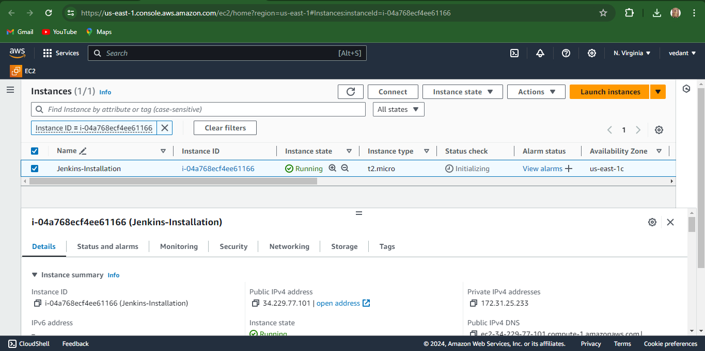
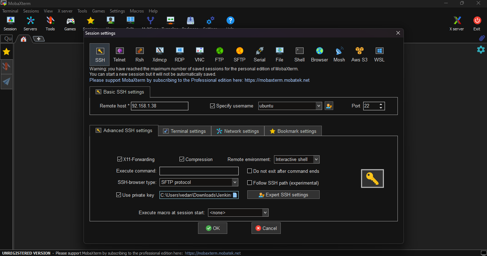
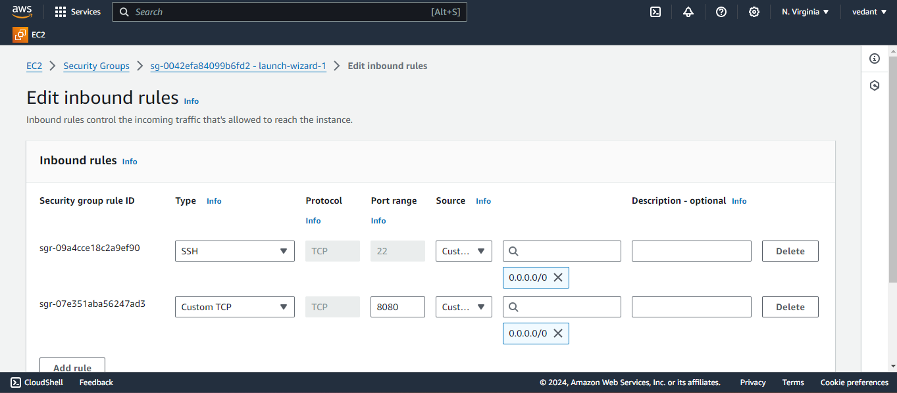
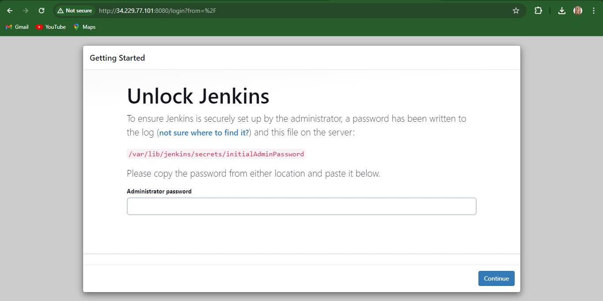
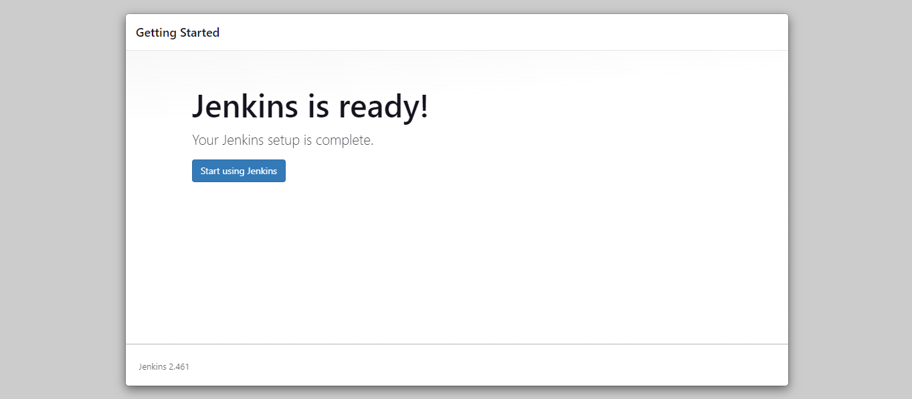

# Setting Up Jenkins on AWS EC2

This repository contains a detailed guide and necessary scripts to set up Jenkins on an AWS EC2 instance. Follow the steps below to get Jenkins up and running on your own server.

## Table of Contents

- [Prerequisites](#prerequisites)
- [Step-by-Step Guide](#step-by-step-guide)
  - [1. Create an EC2 Instance](#1-create-an-ec2-instance)
  - [2. Connect to the EC2 Instance](#2-connect-to-the-ec2-instance)
  - [3. Install Java JDK](#3-install-java-jdk)
  - [4. Verify Java is Installed](#4-Verify-Java-is-Installed)
  - [5. Add Jenkins Repository and Install Jenkins](#5-add-jenkins-repository-and-install-jenkins)
  - [6. Open Port 8080](#6-open-port-8080)
  - [7. Unlock Jenkins](#7-unlock-jenkins)
  - [8. Set Up Jenkins](#8-set-up-jenkins)
  - [9. Jenkins is Ready!!](#9-Jenkins-is-Ready!!)
- [Scripts](#scripts)
- [Images](#images)
- [Contributing](#contributing)

## Prerequisites

- An AWS account
- Basic knowledge of AWS EC2
- MobaXterm or another SSH client
- Internet connection

## Step-by-Step Guide

### 1. Create an EC2 Instance

Launch a new EC2 instance using Amazon Linux 2 AMI. Choose an instance type that fits your workload requirements. Follow the [AWS documentation](https://docs.aws.amazon.com/AWSEC2/latest/UserGuide/EC2_GetStarted.html) for detailed steps.




### 2. Connect to the EC2 Instance

Use MobaXterm or another SSH client to connect to your EC2 instance securely using your private key.




### 3. Install Java JDK

Update the package lists and install the Java Development Kit (JDK):

```bash
sudo apt update
sudo apt install openjdk-11-jre
```

### 4. Verify Java is Installed

```bash
java -version
```

### 5. Add Jenkins Repository and Install Jenkins

Import the Jenkins repository key and add the repository. Then, update the package lists and install Jenkins:

```bash
curl -fsSL https://pkg.jenkins.io/debian/jenkins.io-2023.key | sudo tee /usr/share/keyrings/jenkins-keyring.asc > /dev/null
echo deb [signed-by=/usr/share/keyrings/jenkins-keyring.asc] https://pkg.jenkins.io/debian binary/ | sudo tee /etc/apt/sources.list.d/jenkins.list > /dev/null
sudo apt-get update
sudo apt-get install jenkins
```


### 6. Open Port 8080
Edit the security group inbound rules to allow traffic on port 8080.



### 7. Set Up Jenkins
Access Jenkins through your browser by navigating to the public IP address of your EC2 instance followed by port 8080. Follow the setup wizard to install recommended plugins and create an admin user account.


### 8. Unlock Jenkins
Retrieve the initial administrative password to unlock Jenkins:
```bash
sudo cat /var/lib/jenkins/secrets/initialAdminPassword
```


### 9. Jenkins is Ready!!



### Once you are done with the above steps, it is better to restart Jenkins.
```bash
http://<ec2-instance-public-ip>:8080/restart
```
## Docker Slave Configuration
Run the below command to Install Docker
```bash
sudo apt update
sudo apt install docker.io
```
Grant Jenkins user and Ubuntu user permission to docker deamon.
```bash
sudo su - 
usermod -aG docker jenkins
usermod -aG docker ubuntu
systemctl restart docker
```
Once you are done with the above steps, it is better to restart Jenkins again.
```bash
http://<ec2-instance-public-ip>:8080/restart
```
